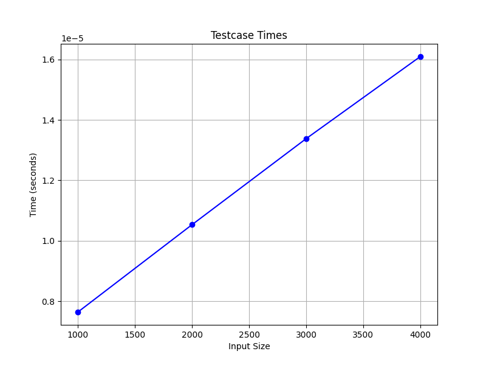

   

# Digital Simulator

A program to design and simulate digital circuits

The idea is to create something akin to [Digital](https://github.com/hneemann/Digital) although less ambitious.

We will not implement it in Java, but in Python and use the [PyGame](https://github.com/pygame/pygame) package to render the graphical user interface. Because we use [Pygame-gui](https://github.com/MyreMylar/pygame_gui) for user interface elements like buttons and file dialogs, we will actually use the [Pygame-ce fork](https://github.com/pygame-community/pygame-ce) because pygame-gui has a hard dependency on that and will install it automatically, but that makes no difference to the functionality. I don't see any real advantage of using pygame-ce, but its development does indeed seem to be more active.

## project goals

This project is not so much about digital simulations per se, but more about learning some more about a few interesting pieces of technology:

- gain some experience with pygame

  pygame appears to be quite fast and flexible, albeit it little low level. However, this should enable us to create both a menu elements like buttons, as well as other graphical elements like representations of logical gates that change their appearance according to the state the get during a simulation. For buttons and more complex gui elements like fiel dialogs, we rely on components
  that are provided directly by pygame and pygame-gui, but the gate and line elements are created by us, so we can gain some experience with the low level stuff that is needed for that.
  
- gain some experience with pyinstaller 

  The promise of [pyinstaller](https://github.com/pyinstaller/pyinstaller) is that it will be able to create a single executable out of our collection of Python modules will the dependencies bundled inside it.
  I have never done that before, but because this makes it really easy to distribute the program, it is an interesting subject to test.

- a proper test framework

  At the very least for all logical components and simulation related stuff. Not sure how we could create a good test framework for the interaction though; we'd have tot hink about that one,
  but pygame and pygame-gui events can be created as needed and inserted in the event queue, so we should be able to test that too. The ideas in [this blog](https://blog.codemanship.dev/how-to-feature-test-your-pygame-game) allow us to convert our basic event processors to generators than can be used in our main program as well as in our tests.
  
## design goals

Besides the project goals there are of course some technical goals we would like to reach to make the program at least a little bit useful:

- [ ] simulate all common gates

  And, Or, Xor, Nand, Nor, NXor, along with some helper elements like an input that can be toggled, and lines to connect components.

  (Half done: And, Nand, Input, Ouput and Line work)
      
- [x] save and load designs

  probably as JSON data, but pickling might be an option too.

  (Done: save, load implemented as JSON, load just a library needs to be done yet, and we might want to add some metadata, like date and a HMAC)

- [ ] group elements into reusable blocks and add them to a library

  this would make it possible to build and expand upon a collection of components of increasing complexity. Think latches, flip-flops, adders, ... etc.
      
- [ ] load/add to a library

  Might be as simple as having the library as part of a saved design, so that an empty design can act as a library file.

  (this sort of works already, i.e. the library is save along with the rest, but we do not have code yet to append just a library from a file)

- [ ] add clock input element

  Slightly more complicated than an inout element that can be toggled on or off, but would make the simulation a lot more interesting.
      
- [ ] bundle the whole program into a single executable

  pyinstaller is the first choice, but nothing is set in stone.
      
- [x] have a proper test framework for the logic

  pytest with the coverage and perhaps the performance add-ons should do the job, but the challenge here is to get good coverage. It is not at all clear to me if we can properly test pygame related functionality.

  (Done: tests for the logic components are working with decent coverage, as is the core simulation, but the coverage for the display/user interaction is still pretty low. We did create test, coverage and performances badges, as well as performance graph.)

- [ ] nice to have: busses and nets

  i.e. ways to label connectors and have them interact in a simulation as well as being able to define Line elements with multiple traces.

## current performance

This graphs shows the current timings for a single simulation step, for a varying number of components (i.e. gates, lines and input/outputs)



This looks linear but the slope is less than one. This means that we can expect to get better performance as the number of elements increases even more, but at 4000 gates (= roughly the number of gates in a 6502 processor) we could do more than 20000 steps per second. Not bad for a program written in Python!

## installation

For now, nothing fancy:

```bash
git clone https://github.com/varkenvarken/Digital-Simulator.git
cd Digital-Simulator
pip3 install -r requirements.txt
python3 main.py 
```

Note: you are advised to do this inside a virtual enviroment or a development container.

## requirements

the current [list of requirements](requirements.txt) is a bit long, but that is because I didn´t bother to separate development and test requirements from the other requirements.
