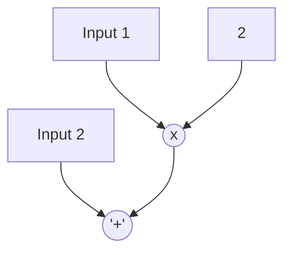

# Fast simulation in Python

Normally I would have started thinking about optimizing some piece of core code *after*[^1] designing,
implementing and testing it in a proper manner, but in this case early on in the design 
I realized that if I wanted to be able to simulate a collection of hundreds of logical gates,
simply traversing a list of them and evaluating their logical functionality wasn't going to cut it.

Yes, it still made sense to design the gates in a proper object oriented way,
with methods to display their icons, calculate dependencies, detect cursor collisions and so forth,
but adding an evaluation method most likely would be way too slow, because if an input element would
change state for example, it might take many iterations for the effects of the change to ripple through
and become stable and we would like to be able to see these effects almost instantly when interacting
with our logical circuit model.

So I decided the separate the core simulation logic from the rest of the code.

## Lookup tables

The idea was to use lookup tables (commonly used in programmable hardware) and because we would be working
with sizeable arrays, switch to numpy to implement those.

The key is that we have two input arrays, one for each input, and an output array, and in addition to those
we also have an array that contains a numerical code for each operation. So 0 for `and`, 4 for `or`, 8 for `xor`,
and so forth.

Now what we do for each round is that we add up the both inputs, where we multiply the second input by 2 first,
and then we add our function code and look up that combination in a lookup table that we pre-calculated.
The results is either a one or a zero, and that's what we store in the output array.

Then we have two additional arrays that map the output to the inputs again, so for every input we have an index
that says that the output at the given index should be put into that input array.
The following picture illustrates this more clearly:



These operations can be done quickly if we use numpy, which allows us to work on arrays with thousands of entries very efficiently.
We have a look at the code in a moment. But how do these lookup functions work? Well, let's have a look at the `and` function: 
it has two inputs and the result can be either 1 or 0, depending on whether all inputs are ones or zeros.
So if we look at two inputs together, the combination of the two inputs can be 0, 1, 2, or 3, so what we can do is simply create
a table with 4 entries and index this with this combined input; the result will then be either a 0 or a 1, depending on that input,
so in this particular case for the `and` function it will be a 1 if the input combination equals 3 and 0 otherwise.
We can do this for all logical operations and then create a combined lookup table that combines the inputs, so always 0, 1, 2, or 3,
with a function and of course if you want to add this we need to keep some space for those inputs,
so we multiply this function index by 4 so we get 0 for `and` 4 for `or` 8 for exclusive or etc etc.

The first part of this lookup table looks like this (so index = A * 2 + B + Func):

Index|A|B| Func |Out|
-----|-|-|------|-|
0|0|0|000000|0|
1|0|1|000000|0|
2|1|0|000000|0|
3|1|1|000000|1|
4|0|0|000100|0|
5|0|1|000100|1|
6|1|0|000100|1|
7|1|1|000100|1|


If we limit the index to our lookup table to 8 bits, we have 6 bits left to encode our logical functions
(because two bits are set aside for the input values). This allows us to encode 64 different logical functions,
and that is more than enough [^2]

## Implementation

The code to implement this with numpy is really short (full code in [simulation.py](/simulator/simulation.py))

```python
    def simulate_np(self) -> bool:
        state = self.input1 + 2 * self.input2 + self.operation
        previous_output = self.output
        self.output = self.lookup[state]

        self.input1 = self.output[self.inputmap1]
        self.input2 = self.output[self.inputmap2]

        return np.any(previous_output != self.output)
```

[^1]: "premature optimization is the root of all evil" Tony Hoare (popularized by Donald Knuth)

[^2]: this can in fact encode *all* possible 2-input binary functions, including weird ones that always return 0 or 1 regardless what the input is.
The two inputs allow for four possible input combinations and any response is either a 0 or a 1, so there are 2^4 = 16 different output functions possible in total.
More in this [Wikipedia article](https://en.wikipedia.org/wiki/Truth_table#Sentential_operator_truth_tables)
